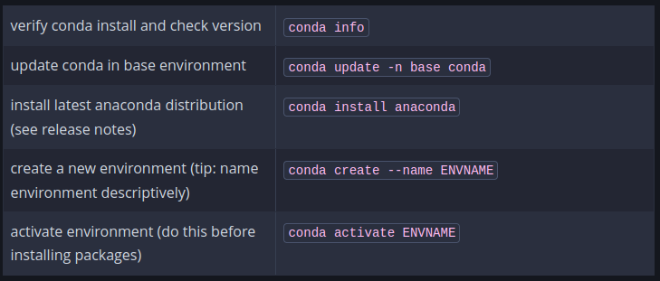

# Conda
##### Conda is a package management tool generally used with python and r language 
* Anaconda (anaconda-navigator) : Contains 300+ packages and also a gui to work with.
* Miniconda : Contains only conda , python and other depnedencies that are needed for them.

`conda comes installed with both miniconda and anaconda`

|Working with conda CLI| cmd |
|---|---
`create new env` | `conda create -n envname` |
`activate new env` | `conda activate env_name`|
`get env info` | `conda env list`, `conda info --envs`,`conda info -e`
`get version` | `conda --version`
`search package` | `conda search scipy`
`install package` | `conda install numpy`
`build package` | `conda build package`

